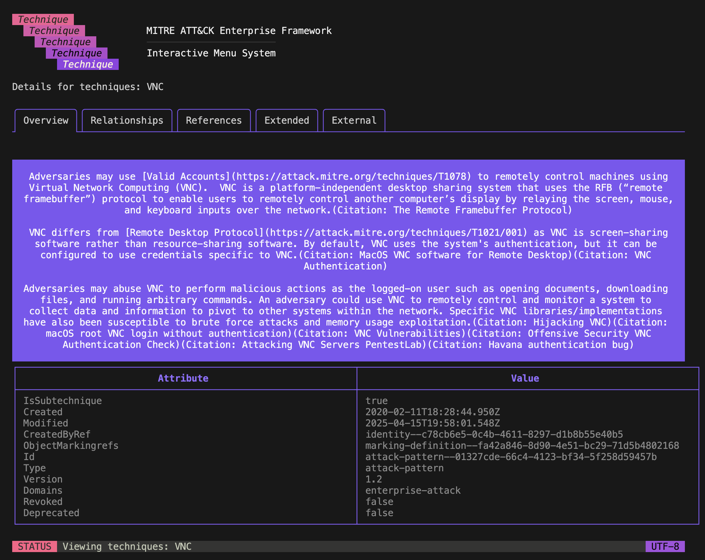

# goattck

[](https://pkg.go.dev/github.com/msadministrator/goattck)
[](https://goreportcard.com/report/github.com/msadministrator/goattck)

A comprehensive Go implementation for interacting with the MITRE ATT&CK Framework, available both as a CLI tool and a Go package.

## Features

- **CLI Interface**: Interactive terminal-based interface for exploring MITRE ATT&CK data
- **Go Package**: Programmatic access to ATT&CK data in your Go applications
- **Enterprise Focus**: Comprehensive coverage of the Enterprise ATT&CK framework
- **Data Management**: Automatic downloading and caching of ATT&CK data
- **Modern UI**: Beautiful terminal interface using bubbletea and lipgloss

## Installation

### CLI Installation

```bash
go install github.com/msadministrator/goattck@latest
```

### Package Installation

```bash
go get github.com/msadministrator/goattck
```

## Usage

### CLI Usage



When using the CLI, you must first specify the data you are wanting to access. Currently this is `enterprise` but there are future plans to extend this beyond just the enterprise framework.

> The enterprise command does not currently do anything so just use the `menu` subcommand.

```bash
goattck enterprise
```

To access the fancy interactive menu, you then must specify the `menu` command. Once you run this command you must select the entity and the specific data object to then display the more detailed view.

```bash
goattck enterprise menu
```

By default, we first download the JSON data from [mitre](https://raw.githubusercontent.com/mitre/cti/master/enterprise-attack/enterprise-attack.json) and store it locally. If you want to retrieve the latest version or update what is stored locally you must run the following command using the `--force` flag.

```bash
goattck enterprise menu --force
```

### Package Usage

When wanting to integrate `goattck` into your project, you can 

```go
import (
    "github.com/msadministrator/goattck"
)

func main() {
 
    enterprise, err := goattck.Enterprise{}.New("https://raw.githubusercontent.com/mitre/cti/master/enterprise-attack/enterprise-attack.json")
    if err != nil {
        // Handle error
    }

    forceDownload := false
    enterprise, err = enterprise.Load(forceDownload)
    
    // Access ATT&CK data
    for _, technnique := range enterprise.Techniques {
        fmt.Printf("technique: %s", technique.Name)
    }
}
```

## Data Models

The package provides comprehensive models for ATT&CK data:

- `Actor`: Threat actor information
- `Technique`: ATT&CK techniques
- `Tactic`: Tactics used in the framework
- `Malware`: Malware information
- `Tool`: Tools used in attacks
- `Campaign`: Campaign information
- `Mitigation`: Mitigation strategies
- `DataSource`: Data sources for detection
- `DataComponent`: Components of data sources

## Contributing

Contributions are welcome! Please feel free to submit a Pull Request.

## Acknowledgments

- [MITRE ATT&CK](https://attack.mitre.org/)
- [pyattck](https://github.com/swimlane/pyattck)
- [bubbletea](https://github.com/charmbracelet/bubbletea)
- [lipgloss](https://github.com/charmbracelet/lipgloss)
